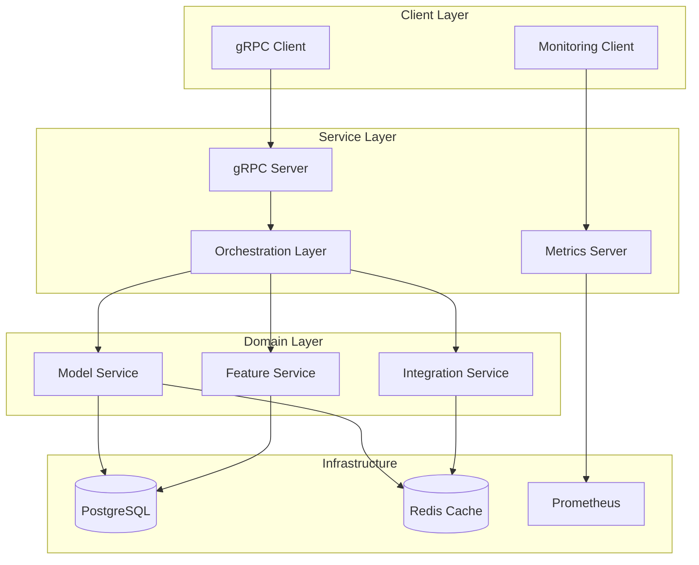

# Smart Service

A scalable, gRPC-based microservice for managing smart devices and their features with real-time monitoring capabilities.

## Features

- 🔄 **Model Management**: Create and manage smart device models
- 🎯 **Feature Configuration**: Dynamic feature management system
- 🔌 **Integration Support**: Built-in IoT and Weather service integrations
- 📊 **Real-time Monitoring**: Prometheus metrics and health checks
- 🚀 **Kubernetes Ready**: Full container orchestration support
- 🔒 **Security First**: Built-in authentication and authorization

## Documentation

- [API Reference](docs/api.md)
- [Development Guide](docs/development.md)

## Quick Start

### Prerequisites

- Python 3.9+
- Docker & Kubernetes (minikube)
- PostgreSQL 14+
- Redis (optional, for caching)

### Local Development

```bash
# Clone repository
git clone https://github.com/yourusername/smart-service.git
cd smart-service

# Create virtual environment
python -m venv .venv
source .venv/bin/activate

# Install dependencies
pip install -r requirements.txt

# Generate proto files
make generate-proto

# Run tests
make test

# Start local service
make run
```

### Docker Deployment

```bash
# Build image
docker build -t smart-service:latest .

# Run container
docker run -p 50051:50051 smart-service:latest
```

### Kubernetes Deployment

```bash
# Start minikube
minikube start

# Deploy service
kubectl apply -f kubernetes/
```

## Project Structure

```
smart-service/
├── src/                 # Source code
│   ├── domain/         # Domain models and rules
│   ├── services/       # Business logic
│   ├── integrations/   # External integrations
│   └── utils/          # Shared utilities
├── tests/              # Test suite
├── kubernetes/         # K8s manifests
└── docs/              # Documentation
```



## Testing

```bash
# Run all tests
pytest or pytest tests/ -v

# Run with coverage
pytest --cov=src
```

## Contributing

1. Fork the repository
2. Create your feature branch
3. Commit your changes
4. Push to the branch
5. Create a Pull Request
