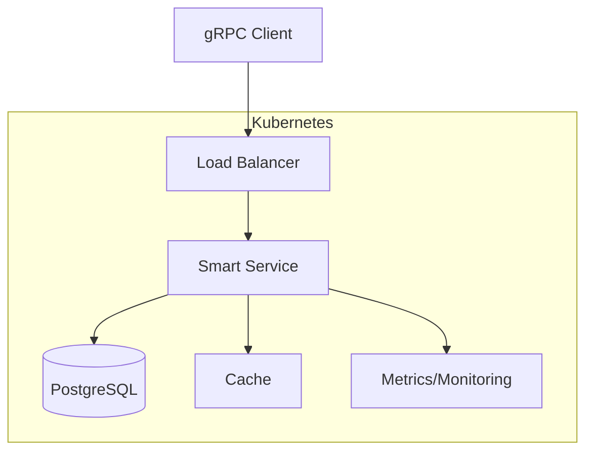
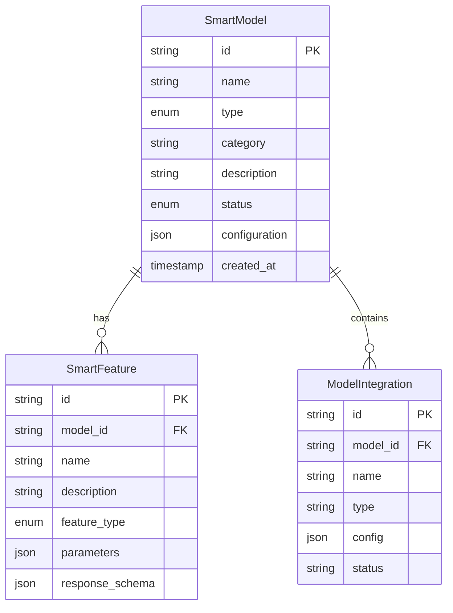

# Smart Service Documentation

## Table of Contents
1. Architecture Overview
2. API Documentation
3. Development Guide
4. Database Schema
5. Deployment Guide

## 1. Architecture Overview
Smart Service is a microservice-based system built with:
- gRPC for service communication
- PostgreSQL for data persistence
- Kubernetes for orchestration
- Prometheus for monitoring

### System Components


## 2. API Documentation
### Service Definition
```protobuf
service SmartService {
    rpc CreateModel (CreateModelRequest) returns (SmartModel);
    rpc UpdateModel (UpdateModelRequest) returns (SmartModel);
    rpc GetModel (GetModelRequest) returns (SmartModel);
    rpc SearchModels (SearchModelsRequest) returns (SearchModelsResponse);
    rpc AddFeature (AddFeatureRequest) returns (SmartFeature);
}
```

### Message Types
[Proto definitions here]

## 3. Development Guide
### Prerequisites
- Python 3.9+
- Docker
- Kubernetes (minikube)
- PostgreSQL

### Local Setup
1. Clone repository
2. Install dependencies
3. Start local environment

### Testing
1. Unit tests
2. Integration tests
3. Load tests

## 4. Database Schema


## 5. Deployment Guide
### Kubernetes Deployment
1. Requirements
2. Configuration
3. Deployment steps
4. Monitoring setup

### Production Considerations
1. Scaling
2. High Availability
3. Backup & Recovery
4. Security