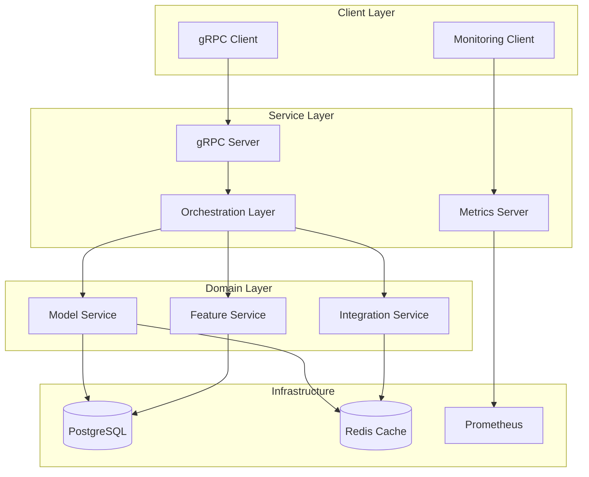
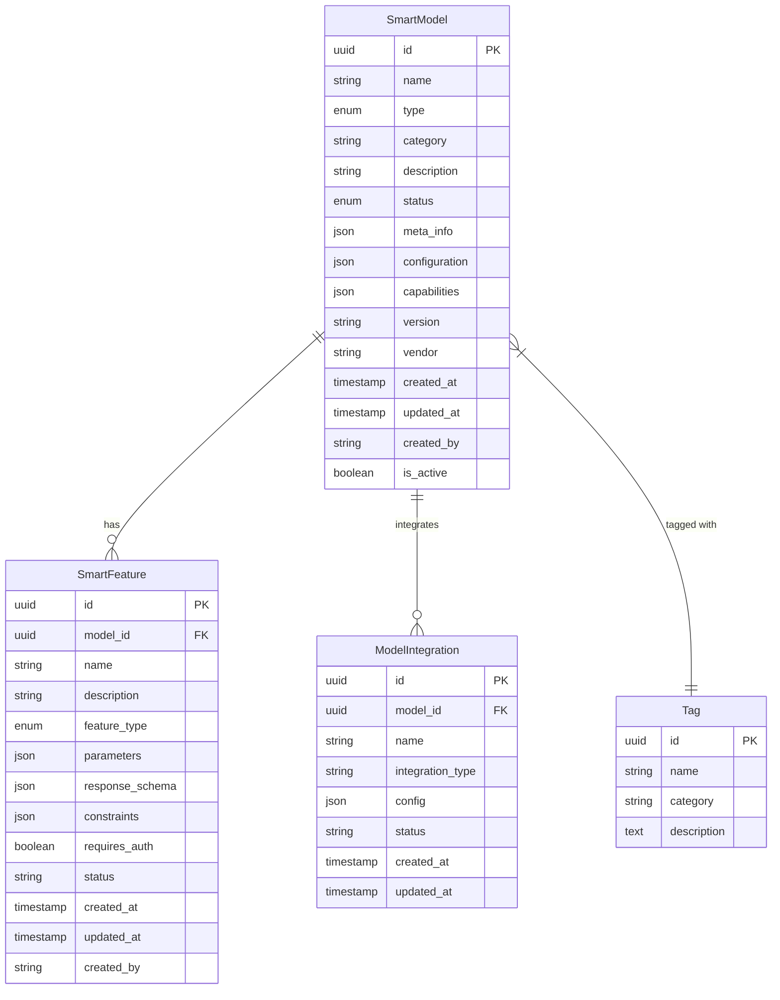

# Smart Service Development Guide

## System Architecture Overview


## Database Schema


## Development Environment Setup

### Prerequisites
```bash
# Required software
python 3.9+
postgresql 14+
docker & kubernetes (minikube)
redis
```

### Initial Setup
```bash
# Create virtual environment
python -m venv .venv
source .venv/bin/activate

# Install dependencies
pip install -r requirements.txt

# Generate proto files
make generate-proto

# Setup local database
make setup-db
```

### Development Workflow
## Code Organization
   ```
   src/
   ├── domain/           # Domain models and business rules
   │   ├── models.py     # Core domain entities
   │   └── rules.py      # Business rules and validations
   │
   ├── services/         # Application services
   │   ├── model.py      # Model management
   │   └── feature.py    # Feature management
   │
   ├── events/                 # Event handling
   │   ├── __init__.py
   │   ├── handlers.py        # Event handlers
   ├── integrations/     # External integrations
   │   ├── base.py       # Base integration class
   │   └── manager.py    # Integration management
   │
   ├── orchestration/        # Orchestration layer
   │   ├── __init__.py
   │   ├── orchestrator.py  # Main orchestration logic
   |
   ├── proto/               # Protocol Buffers
   │   ├── __init__.py
   │   └── smart_service.proto
   │ 
   └── utils/           # Shared utilities
       ├── monitoring.py # Metrics and monitoring
       └── cache.py     # Caching utilities
   ```

## Testing Strategy

### Test Structure
```
tests/
├── conftest.py           # Shared test fixtures and configurations
├── unit/                 # Unit tests for individual components
│   └── test_models.py    # Domain model and entity tests
│
└── integration/          # Integration tests
    ├── test_service.py   # Service layer integration tests
    └── test_integration.py # External integration tests
```

### Test Types

#### 1. Unit Tests (`tests/unit/`)
- **Purpose**: Test individual components in isolation
- **Coverage**: 
  - Domain models (SmartModel, SmartFeature)
  - Business rules and validations
  - Model status transitions
  - Entity behavior
- **Example**:
  ```python
  def test_create_smart_model(db_session, sample_model_data):
      model = SmartModel(**sample_model_data)
      assert model.status == ModelStatus.DRAFT
      assert model.is_active is True
  ```

#### 2. Integration Tests (`tests/integration/`)
- **Purpose**: Test component interactions and service layer
- **Coverage**:
  - Service layer operations
  - Database interactions
  - External integrations (IoT, Weather)
  - Business workflows
- **Example**:
  ```python
  async def test_feature_addition(model_service, feature_service, 
                                sample_model_data, sample_feature_data):
      model = await model_service.create_model(sample_model_data, "test_user")
      feature = await feature_service.add_feature(model.id, 
                                                sample_feature_data, 
                                                "test_user")
      assert feature.model_id == model.id
  ```

### Test Fixtures
- **Database**: In-memory SQLite for tests
- **Cache**: Mock implementation
- **External Services**: Mocked responses
- **Sample Data**: Predefined test data fixtures

### Running Tests
```bash
# Run all tests
pytest tests/

# Run with coverage
pytest --cov=src tests/

# Run specific test type
pytest tests/unit/
pytest tests/integration/
```

### Best Practices
1. **Isolation**: Each test should be independent
2. **Fixtures**: Use shared fixtures for common setup
3. **Mocking**: External dependencies should be mocked
4. **Async/Await**: Use pytest-asyncio for async tests
5. **Clean Setup/Teardown**: Use fixtures for proper cleanup

##  Local Development
   ```bash
   # Start local services
   make dev

   # Run tests
   make test

   # Check code quality
   make lint
   ```

### Common Development Tasks

#### Adding a New Model Type
1. Update `models.py`:
   ```python
   class ModelType(PyEnum):
       NEW_TYPE = "NEW_TYPE"
   ```
2. Add validations in `rules.py`
3. Update proto definition
4. Generate proto files
5. Add tests

#### Implementing a New Integration
1. Create new integration class:
   ```python
   class NewIntegration(BaseIntegration):
       async def connect(self) -> bool:
           # Implementation
           pass

       async def execute(self, action: str, params: Dict) -> Dict:
           # Implementation
           pass
   ```
2. Register in IntegrationFactory
3. Add configuration
4. Add tests

#### Adding New API Endpoint
1. Update proto definition
2. Generate proto files
3. Implement service method
4. Add tests
5. Update documentation

### Debugging Tips
- Using debugger
- Monitoring metrics
- Checking logs
- Common issues and solutions